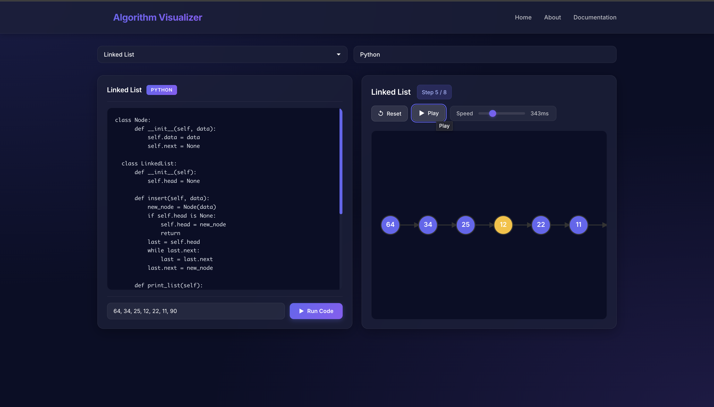
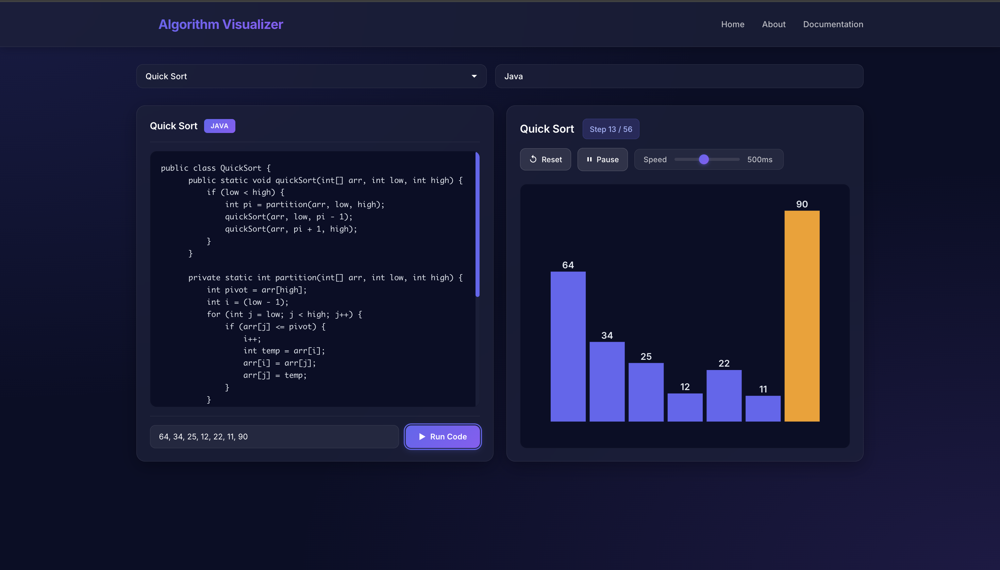
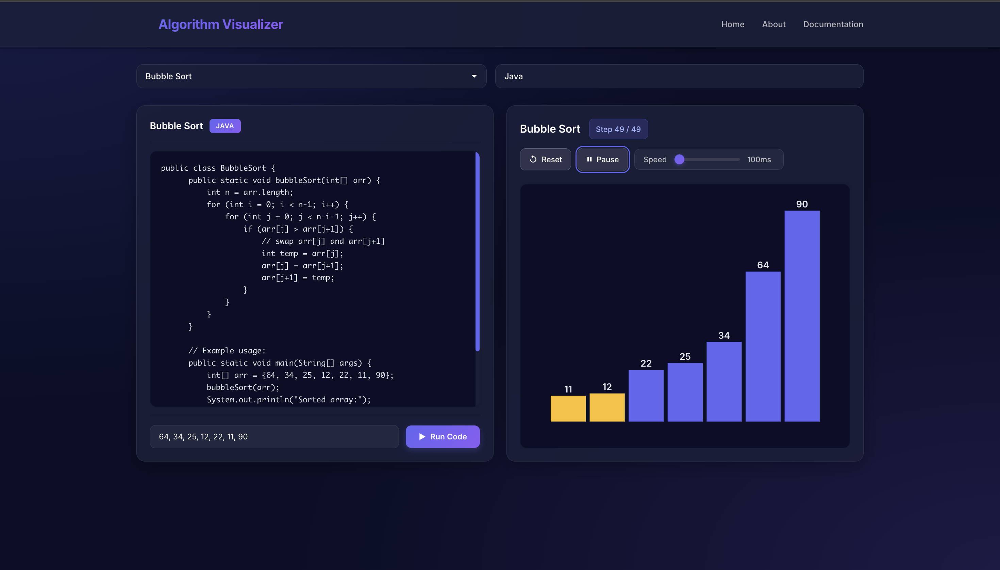

<div align="center">
  <h1>Algorithm Visualizer 🎯</h1>
  <h1>https://algorithm-visualizer-wjs7.onrender.com/</h1>
  <p>
    
    
    
    
    
    
  </p>
  <p>An interactive web application for visualizing data structures and algorithms</p>
</div>

## 🎨 Screenshots


### Modern Interface Overview
<div align="center">
  
  <p><em>Modern dark-themed interface with glassmorphism effects, gradient accents, and intuitive two-panel layout</em></p>
</div>

The interface features:
- **Glassmorphism Navigation Bar**: Semi-transparent navbar with blur effects and animated hover states
- **Code Editor Panel**: Dark-themed editor with syntax highlighting and language badges
- **Visualization Panel**: Interactive D3.js visualizations with real-time controls

### Quick Sort Visualization
<div align="center">
  
  <p><em>Visualizing Quick Sort algorithm with step-by-step execution, color-coded pivot elements, and comparison highlights</em></p>
</div>

Key features shown:
- Color-coded bars indicating algorithm state (blue for normal, orange for pivot, yellow for comparison)
- Step counter showing progress (e.g., "Step 10 / 25")
- Speed control slider for animation adjustment
- Play/Pause and Reset controls

### Bubble Sort in Action
<div align="center">
  
  <p><em>Interactive Bubble Sort visualization demonstrating element comparison and swapping with real-time visual feedback</em></p>
</div>

Demonstrates:
- Real-time element comparison (highlighted in yellow)
- Swapping operations (highlighted in red)
- Step-by-step progression through the sorting process
- Customizable test array input

## 🎯 Key Highlights

- **Modern UI/UX Design**: Sleek dark theme with glassmorphism effects, smooth animations, and intuitive controls
- **Interactive Visualizations**: Step-by-step algorithm execution with color-coded elements
- **Multi-Language Code Editor**: Syntax-highlighted code editor supporting Java and Python
- **Real-Time Controls**: Play, pause, reset, and speed adjustment for algorithm visualization
- **Responsive Design**: Works seamlessly across different screen sizes

<h2>✨ Features</h2>

<details>
<summary>Interactive Visualizations</summary>
<br>
  
- **Sorting Algorithms**
  - Bubble Sort
  - Quick Sort
- **Searching Algorithms**
  - Binary Search
- **Data Structures**
  - Linked List
  - Binary Tree
</details>

<details>
<summary>Multi-Language Support</summary>
<br>

- Java
- Python
</details>

<details>
<summary>Real-Time Controls</summary>
<br>

- ⏯️ Play/Pause functionality
- 🎚️ Speed adjustment
- 👣 Step-by-step progression
- 🔄 Reset capability
</details>

## 🚀 How It Works

### Interface Components

1. **Navigation Bar**
   - Modern glassmorphism design with gradient logo
   - Quick access to Home, About, and Documentation sections
   - Smooth hover animations

2. **Code Editor Panel** (Left Side)
   - Select algorithm from dropdown menu
   - Choose programming language (Java/Python)
   - View and edit algorithm code with syntax highlighting
   - Enter custom test array values
   - Run code to generate visualization steps

3. **Visualization Panel** (Right Side)
   - Real-time algorithm visualization using D3.js
   - Color-coded elements:
     - 🔵 Blue: Normal elements
     - 🟡 Yellow: Elements being compared
     - 🟠 Orange: Pivot element (for Quick Sort)
     - 🟢 Green: Found element (for Binary Search)
     - 🔴 Red: Elements being swapped
   - Interactive controls:
     - Reset: Start visualization from beginning
     - Play/Pause: Control animation playback
     - Speed Slider: Adjust animation speed (100ms - 1000ms)
     - Step Counter: Track current step in algorithm execution

### Visualization Process

1. Select an algorithm from the dropdown
2. Choose your preferred programming language
3. Optionally modify the test array input
4. Click "Run Code" to start visualization
5. Use controls to play, pause, adjust speed, or reset
6. Watch the algorithm execute step-by-step with color-coded visual feedback

<h2>🛠️ Languages and Tools</h2>

<p align="left">
  <a href="https://reactjs.org/" target="_blank" rel="noreferrer">
    
  </a>
  <a href="https://www.java.com" target="_blank" rel="noreferrer">
    
  </a>
  <a href="https://www.python.org" target="_blank" rel="noreferrer">
    
  </a>
  <a href="https://d3js.org/" target="_blank" rel="noreferrer">
    
  </a>
  <a href="https://developer.mozilla.org/en-US/docs/Web/JavaScript" target="_blank" rel="noreferrer">
    
  </a>
  <a href="https://nodejs.org" target="_blank" rel="noreferrer">
    
  </a>
</p>

<h2>⚡ Installation</h2>

1. Clone the repository
```bash
git clone https://github.com/yourusername/algorithm-visualizer.git
